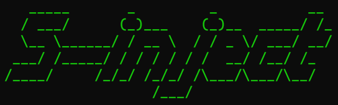

  [English](./readme_en.md)

<h1><p align="center">inject-mcp</p></h1>

<p align="center">使用模型上下文协议完成多种 DLL Shellcode 的注入</p>

<p align="center"></p>

使用[S-inject](https://github.com/Joe1sn/S-inject)项目的dll版本作为核心功能实现，特殊dll格式请参考S-inject项目，项目的`Test Files`也包含部分测试文件

**免责声明：** 本工具仅供教育和授权测试目的使用。开发者及贡献者不支持、不鼓励也不赞成任何非法或未经授权的使用。 用户有责任确保其使用本工具的行为符合所有适用的法律法规。严禁将本工具用于任何未经授权的活动。 开发者及贡献者对使用本工具造成的任何损害或后果不承担责任。使用前请自行承担风险。 通过使用本工具，您同意这些条款，并对您的行为承担全部责任。

# 安装

和一般的安装步骤一样，在你的`MCP Server`按照如下配置

```json
{
  "name": "inject-mcp",
  "key": "injectMCP",
  "command": "uv",
  "args": [
    "--directory",
    "D:\\Github\\inject-mcp",
    "run",
    "main.py"
  ]
}
```

- **--directory**：请写你的本地项目的路径

# 演示

```
使用inject这个AI工具向名称为 x64dbg 的进程使用 CreateRemoteThread 方法注入本地DLL：D:\Github\S-inject\Test Files\TestDll_x64.dll
```

```
使用inject这个AI工具向名称为 x64dbg 的进程使用 远程线程 方法注入Shellcode：SDH/SPfnZUiLWGBIi1sYSItbIEiLG0iLG0iLWyBJidiLWzxMAcNIMclmgcH/iEjB6QiLFAtMAcJNMdJEi1IcTQHCTTHbRItaIE0Bw00x5ESLYiRNAcTrMltZSDHASIniUUiLDCRIMf9BizyDTAHHSInW86Z0BUj/wOvmWWZBiwREQYsEgkwBwFPDSDHJgMEHSLgPqJaRuoeanEj30EjB6AhQUeiw////SYnGSDHJSPfhUEi4nJ6TnNGah5pI99BQSInhSP/CSIPsIEH/1g==
```

<video src="./README.assets/2025-04-06 15-17-21.mp4"></video>

# TODO

- [ ] FIX: 加载网络中的DLL失效
- [ ] Feat: 32位注入支持
- [ ] Feat: 自动分别32/64位后，自动注入
